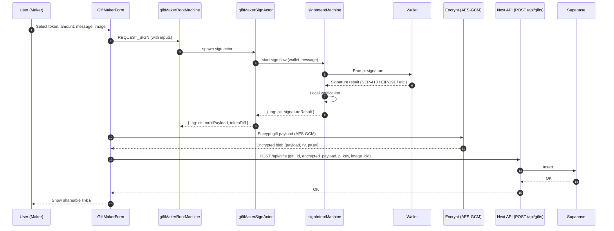
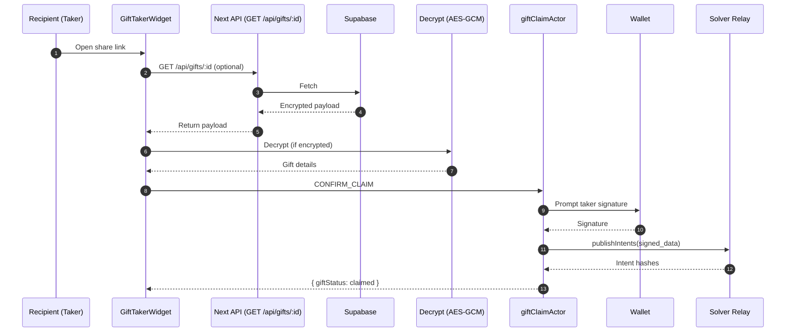

# Near Gift Demo — Architecture

This document explains how the demo is put together, the major modules, and how data and control flow through the app. It is meant to be read alongside the code to accelerate learning.

## 1) System Overview

The demo is a minimal Next.js App Router app that showcases a didactic “gift card” flow on Near Intents. It intentionally avoids non‑essential abstractions to keep the mental model small.

- Framework: Next.js 15 (App Router) + React 19
- State: XState for long‑lived workflows (sign/claim/settlement), tiny React context for modals
- SDKs: `@defuse-protocol/intents-sdk` and `@defuse-protocol/internal-utils`
- Storage: Supabase (persist encrypted gifts + WebAuthn credentials)
- Networking: Native `fetch` via Next.js API routes
- Styling/Components: Tailwind + small usage of Radix UI

## 2) Runtime Layers

- UI (React Components)
  - Gift creation: `src/app/gift-card/create-gift/page.tsx`
  - Gift viewing/claim: `src/app/gift-card/view-gift/page.tsx`
- Feature layer (Gift)
  - Components: `src/components/DefuseSDK/features/gift/components/*`
  - XState actors/machines: `src/components/DefuseSDK/features/gift/actors/*`, plus shared machines in `src/components/DefuseSDK/features/machines/*`
- Utilities
  - Signing/verification: `src/components/DefuseSDK/utils/verifyWalletSignature.ts`, `webAuthn.ts`
  - Token math/helpers: `src/components/DefuseSDK/utils/tokenUtils.ts`, `format.ts`, `token.ts`
  - Near helpers: `src/components/DefuseSDK/utils/near.ts`
- API
  - `POST /api/gifts`: `src/app/api/gifts/route.ts`
  - `GET /api/gifts/[giftId]`: `src/app/api/gifts/[giftId]/route.ts`
- Configuration
  - `src/components/DefuseSDK/config.ts` (SDK env)
  - `src/libs/defuse-sdk/initSDK.ts` (runtime SDK setup)
  - `src/utils/environment.ts` (typed env)

## 3) High‑Level Flows

### Create Gift (Happy Path)

### View / Claim Gift (Happy Path)

## 4) State Machines (XState)

Only the longest‑lived, error‑prone bits are modeled as machines.

- Gift Maker Root: `src/components/DefuseSDK/features/gift/actors/giftMakerRootMachine.ts`
  - Creates child actors: sign, publishing, settlement
- Gift Sign Actor: `src/components/DefuseSDK/features/gift/actors/giftMakerSignActor.ts`
  - Computes token splits, creates wallet message, coordinates `signIntentMachine`
  - Fallbacks for insufficient balances; produces a coherent multiPayload
- Sign Intent Machine: `src/components/DefuseSDK/features/machines/signIntentMachine.ts`
  - States: Signing → Verifying Signature → Verifying Public Key Presence → Completed / Error
  - Handles wallet errors, SIG verification, and optional NEP‑413 public key add flow via `publicKeyVerifierMachine.ts`
- Gift Claim Actor: `src/components/DefuseSDK/features/gift/actors/shared/giftClaimActor.ts`
  - Signs a claim message as taker; publishes to the solver relay; can wait for settlement

Why XState?
- Better observability, retries, and error handling for flows that cross the network and a wallet boundary

## 5) Modal State

A tiny, explicit context keeps modal state: `src/components/DefuseSDK/providers/ModalStoreProvider.tsx`
- Holds `{ modalType, payload }` and two functions: `setModalType`, `onCloseModal`
- Asset selection modal: `src/components/DefuseSDK/components/Modal/ModalSelectAssets.tsx`
  - Receives `tokenList` via payload → filters/sorts → returns selected token back in payload on close

## 6) Signing & Verification

- NEP‑413 (Near), EIP‑191 (EVM), ed25519 (Solana/Stellar), WebAuthn
- Implementation: `src/components/DefuseSDK/utils/verifyWalletSignature.ts`, `webAuthn.ts`
- Public key add (Near NEP‑413): `src/components/DefuseSDK/features/machines/publicKeyVerifierMachine.ts`

Security notes:
- Payloads are encrypted client‑side (AES‑GCM) before storage (`src/app/gift-card/_utils/encoder.ts`)
- Links use a base64url-encoded blob in the hash so they aren’t sent to servers by default when sharing
- Always verify signatures locally (done in `signIntentMachine`)

## 7) Environment & SDK Config

- Select the Near Intents environment (`production` or `stage`) via `NEXT_PUBLIC_INTENTS_ENV`
- SDK config: `src/components/DefuseSDK/config.ts` and `src/libs/defuse-sdk/initSDK.ts`
- Base URL: `NEXT_PUBLIC_BASE_URL` (for absolute URL resolution in a few code paths)

## 8) Error Handling & Logging

- App logger: `src/utils/logger.ts` (central hook)
- Local error helpers: `src/components/DefuseSDK/utils/errors.ts` + XState transitions with guarded fallbacks
- Typical patterns: capture error, log with context, convert to friendly UI state

## 9) Data Model

- Supabase tables (via `yarn db:setup:js` → `scripts/setup-db.sql`):
  - `public.gifts`: `{ gift_id, encrypted_payload, p_key, image_cid, created_at }`
  - `public.webauthn_credentials`: registries for passkeys if you enable that login path

## 10) Extending the Demo

- Show USD values: re‑introduce a price feed hook and surface it in `GiftMakerForm`
- Add holdings: wire a simple balance polling loop into `depositedBalanceMachine` or replace it with a minimal hook
- Replace modals: use your preferred modal library with the same minimal context
- Analytics: call out to your system from `src/utils/logger.ts`

## 11) Minimal Dependency Footprint

We deliberately avoided:
- Complex global state (Zustand replaced with a tiny context; React Query only used internally by one machine and can be removed)
- Non‑essential SDK surface (kept only what the gift flow requires)
- Tooling bloat (removed Sentry, Biome, Bun, Nix)

## 12) File Map (Selected)

- App routes
  - `src/app/gift-card/create-gift/page.tsx`
  - `src/app/gift-card/view-gift/page.tsx`
- Gift components
  - `src/components/DefuseSDK/features/gift/components/GiftMakerForm.tsx`
  - `src/components/DefuseSDK/features/gift/components/GiftTakerForm.tsx`
- Gift machines/actors
  - `src/components/DefuseSDK/features/gift/actors/giftMakerRootMachine.ts`
  - `src/components/DefuseSDK/features/gift/actors/giftMakerSignActor.ts`
  - `src/components/DefuseSDK/features/gift/actors/shared/giftClaimActor.ts`
  - `src/components/DefuseSDK/features/machines/signIntentMachine.ts`
  - `src/components/DefuseSDK/features/machines/publicKeyVerifierMachine.ts`
- Utils
  - `src/components/DefuseSDK/utils/verifyWalletSignature.ts`
  - `src/components/DefuseSDK/utils/tokenUtils.ts`
  - `src/components/DefuseSDK/utils/near.ts`
  - `src/components/DefuseSDK/utils/assert.ts`
- API
  - `src/app/api/gifts/route.ts`
  - `src/app/api/gifts/[giftId]/route.ts`

---

Questions or improvements? This is meant to be a teaching tool. Prefer clarity over cleverness.

